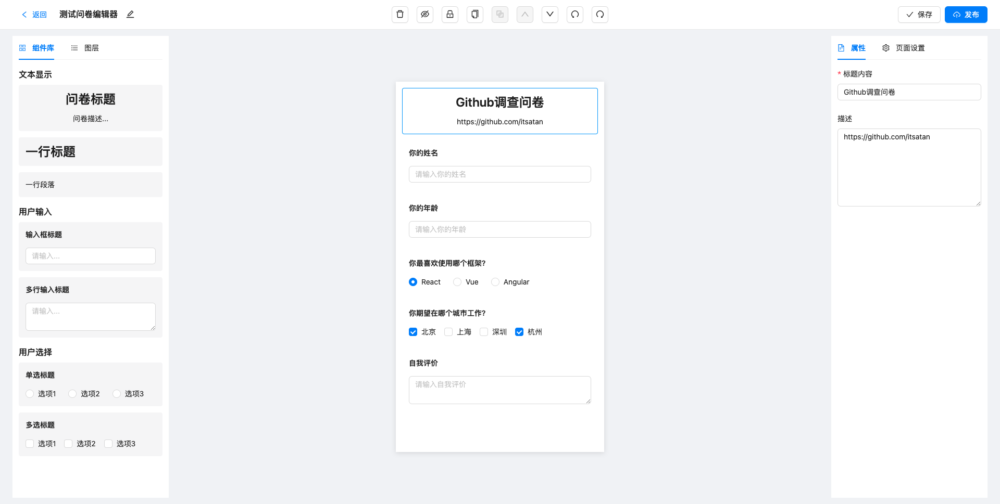

## 可视化编辑器




### 克隆项目

```
git clone https://github.com/itsatan/question-editor.git
```

### 安装/启动

```
yarn install
```

```
yarn dev
```

### 功能介绍

1. 组件删除
2. 上下选中
3. 拖拽排序
4. 自动保存
5. 隐藏/显示
6. 锁定/解锁
7. 复制/粘贴
8. 上移/下移
9. 撤销/重做
10. ......

注: 具体功能请运行项目
